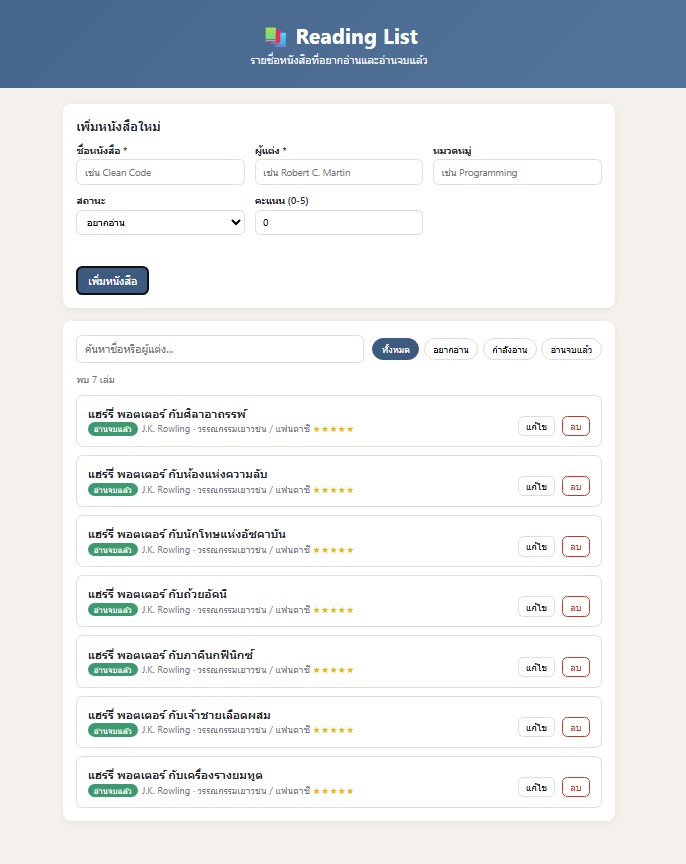
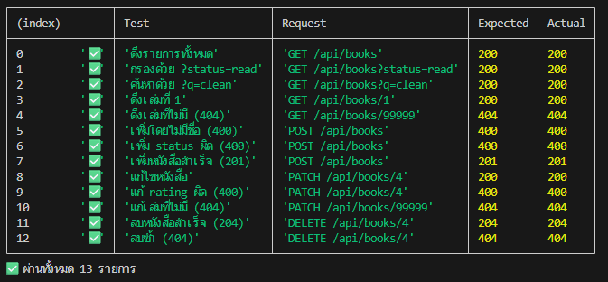

# 📚 Reading List

เว็บแอปพลิเคชัน full-stack ขนาดเล็กสำหรับจัดการรายชื่อหนังสือที่อยากอ่านหรืออ่านจบแล้ว
สร้างด้วย **Node.js + Express** (REST API) และหน้าเว็บ **HTML / CSS / JavaScript** ที่เรียก API ของตัวเองด้วย `fetch()`

## ฟีเจอร์
- ดู / ค้นหา / กรองหนังสือตามสถานะ (อยากอ่าน · กำลังอ่าน · อ่านจบแล้ว) โดยไม่โหลดหน้าใหม่
- เพิ่มหนังสือผ่านฟอร์ม (มีการตรวจข้อมูลทั้งฝั่งเซิร์ฟเวอร์)
- แก้ไขและลบหนังสือ
- ข้อมูลเก็บในไฟล์ `server/data/books.json`

## โครงสร้างโปรเจกต์


แบบข้อความ:

```
reading-list/
├── server/            # Backend
│   ├── index.js       # เริ่มเซิร์ฟเวอร์
│   ├── app.js         # Express app + routes
│   ├── store.js       # อ่าน/เขียนไฟล์ JSON
│   ├── validate.js    # ตรวจสอบข้อมูล
│   └── data/books.json
├── public/            # Frontend
│   ├── index.html
│   ├── style.css
│   └── app.js
├── scripts/api-test.js # สคริปต์ทดสอบทุก endpoint
├── docs/              # รายงาน PDF + screenshots
├── package.json
└── README.md
```

## วิธีติดตั้งและรัน


ต้องมี [Node.js](https://nodejs.org) เวอร์ชัน 18 ขึ้นไป

```bash
npm install
npm run dev      # รันแบบ auto-restart เมื่อแก้ไฟล์
# หรือ
npm start        # รันปกติ
```
จากนั้นเปิด <http://localhost:3000>

## REST API Endpoints

Base URL: `/api/books`

| Method | Endpoint | คำอธิบาย | Status |
|---|---|---|---|
| GET | `/api/books` | ดึงรายการทั้งหมด รองรับ `?status=read\|reading\|want`, `?category=...`, `?q=คำค้น` | 200 |
| GET | `/api/books/:id` | ดึงหนังสือเล่มเดียว | 200 / 404 |
| POST | `/api/books` | เพิ่มหนังสือใหม่ | 201 / 400 |
| PATCH | `/api/books/:id` | แก้ไขบาง field | 200 / 400 / 404 |
| DELETE | `/api/books/:id` | ลบหนังสือ | 204 / 404 |

### โครงสร้างข้อมูล (Book)
| Field | ชนิด | บังคับ | หมายเหตุ |
|---|---|---|---|
| `id` | number | auto | สร้างโดยเซิร์ฟเวอร์ |
| `title` | string | ✅ | ชื่อหนังสือ |
| `author` | string | ✅ | ผู้แต่ง |
| `category` | string | | หมวดหมู่ |
| `status` | `want` \| `reading` \| `read` | | ค่าเริ่มต้น `want` |
| `rating` | integer 0–5 | | ค่าเริ่มต้น `0` |
| `createdAt` | ISO date | auto | |

### ตัวอย่าง
```bash
curl "http://localhost:3000/api/books?status=read"

curl -X POST http://localhost:3000/api/books \
  -H "Content-Type: application/json" \
  -d '{"title":"Dune","author":"Frank Herbert","category":"Sci-Fi"}'

curl -X PATCH http://localhost:3000/api/books/4 \
  -H "Content-Type: application/json" -d '{"status":"read","rating":5}'

curl -X DELETE http://localhost:3000/api/books/4
```

## ภาพหลักฐานการทำงาน

**1) หน้าเว็บ แสดงรายการ / ฟอร์ม / ตัวกรอง (ดึงด้วย `fetch()` ไม่โหลดหน้าใหม่)**



**2) ผลทดสอบ API ทุก endpoint (สถานะ 200 / 201 / 204 / 400 / 404)** ด้วยคำสั่ง `npm run test:api`



ภาพประกอบเพิ่มเติมและคำอธิบายการออกแบบ API ทั้งหมดอยู่ในรายงาน [`docs/report.pdf`](docs/report.pdf)
